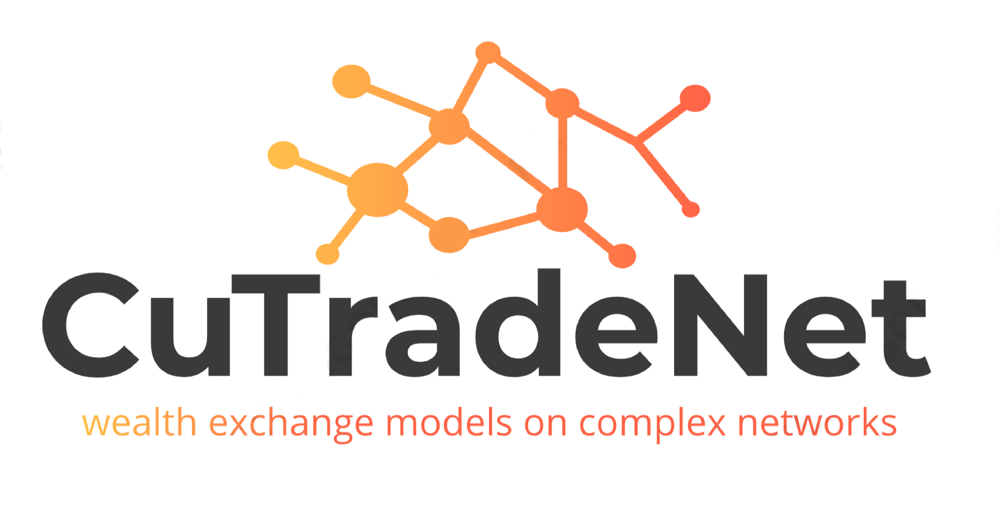

<h1 align="center">

</h1><br>

### **cuTradeNet** is a library that provides classes to easily create & run [*kinetic wealth exchange models*](https://rf.mokslasplius.lt/elementary-kinetic-exchange-models/ "online mini simulations") on complex networks, optimized by using parallel computation.

Leads the user to set one (or ensemble) of *complex networks* as a contact structure agents use to trade about. The following wealth exchange models were implemented:
* [Yard-sale model](https://www.sciencedirect.com/science/article/pii/S0378437120309237 "model details here")
* [Merger-Spinoff model](https://www.sciencedirect.com/science/article/pii/S0378437120309237 "model details here")
* (+ models comming soon)

It is written in Python and uses Cuda module from [Numba](https://numba.pydata.org/ "Numba page") package to accelerate the simulation runnin in GPU, *paralelizing some transaccions* in the same graph and *paralelizing runs* in multiple graphs, leading to  **easier** & **faster** averaging of system properties.
It's completely abstracted from the CUDA knowledge for the user, so you can use it as a regular Python library.

## How to use
There is a [Demo notebook](https://github.com/Qsanti/cuTradeNet/blob/master/Models%26Demo/Demo.ipynb) in the repository that can be tryed in it's [Google Colab](https://colab.research.google.com/github/Qsanti/cuTradeNet/blob/master/Models%26Demo/Demo.ipynb) version too (you can use the package there if you don't have a NVIDIA gpu).

There is also a [General explanation](https://github.com/Qsanti/cuTradeNet/blob/master/Models%26Demo/ModelsList.ipynb) of Kinetic Wealth Exchange Models used.

## How to install
You can install it from [PyPi](https://pypi.org/project/cuTradeNet/ "cuTradeNet page in PyPi") with the following command:
```bash
pip install cuTradeNet
```

### Repository&Questions
The repository is in [GitHub](https://github.com/Qsanti/cuTradeNet/), and you can ask questions or contact us in the [Discussions](https://github.com/Qsanti/cuTradeNet/discussions/ "cuTradeNet discussions") section. 


### CUDA dependencies
In order to use this library in your personal computer you should have a [CUDA capable gpu](https://developer.nvidia.com/cuda-gpus) and download the [CUDA Toolkit](https://developer.nvidia.com/cuda-downloads) for your OS. If you don't fulfill this requirementes you can always use it in [the cloud](https://colab.research.google.com/github/Qsanti/cuTradeNet/blob/master/Models%26Demo/Demo.ipynb). Don't hesitate to [contact us](https://github.com/Qsanti/cuTradeNet/discussions/ "cuTradeNet discussions") to get help!


[](https://zenodo.org/badge/latestdoi/552182062)
